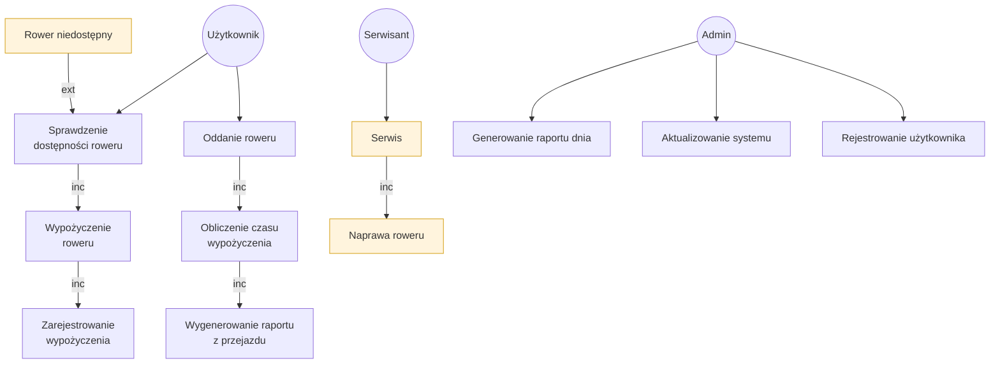
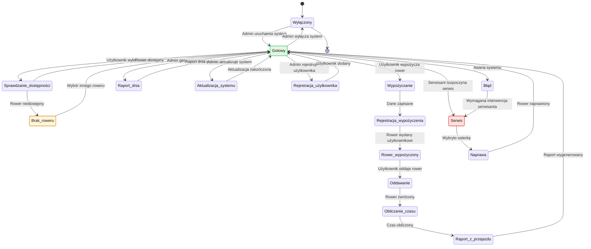

# Wypożyczalnia rowerów

## Schemat blokowy systemu — Flowchart



---

## Diagram stanów systemu — State Diagram



---

# Analiza zastosowanych wzorców projektowych

## Zastosowane wzorce projektowe

### State — Stan

**Cel wzorca:**  
Umożliwia zmianę zachowania obiektu w zależności od jego aktualnego stanu, bez stosowania rozbudowanych instrukcji warunkowych.

**Zastosowanie w systemie:**  
System wypożyczalni rowerów może znajdować się w kilku stanach, takich jak: wyłączony, gotowy, rower wypożyczony, serwis oraz błąd. Każdy stan określa, jakie operacje mogą być wykonane w danym momencie.

**Korzyści:**

- czytelna logika sterowania,
- łatwe dodawanie nowych stanów,
- ograniczenie złożoności kodu.

---

### Command — Polecenie

**Cel wzorca:**  
Hermetyzuje żądanie jako obiekt, co umożliwia łatwe wykonywanie, kolejkowanie i logowanie operacji.

**Zastosowanie w systemie:**  
Operacje takie jak uruchomienie systemu, sprawdzenie dostępności roweru, wypożyczenie roweru, oddanie roweru, serwis, generowanie raportu dnia czy rejestracja użytkownika są realizowane jako osobne obiekty typu Command.

**Korzyści:**

- rozdzielenie nadawcy polecenia od wykonawcy,
- łatwe testowanie i rozbudowa systemu,
- możliwość rejestrowania operacji.

---

### Observer — Obserwator

**Cel wzorca:**  
Zapewnia automatyczne powiadamianie wielu obiektów o zmianach stanu lub zdarzeniach w systemie.

**Zastosowanie w systemie:**  
System wypożyczalni powiadamia obserwatorów o zdarzeniach, takich jak wypożyczenie roweru, oddanie roweru, brak dostępnego roweru, naprawa, aktualizacja systemu czy wygenerowanie raportu.

Obserwatorami są:

- `ActivityLogger`,
- `AdminPanel`,
- `UserNotification`.

**Korzyści:**

- luźne powiązania pomiędzy komponentami,
- łatwe dodawanie nowych modułów monitorujących,
- dobra skalowalność.

---

### Strategy — Strategia

**Cel wzorca:**  
Umożliwia dynamiczną zmianę algorytmu działania bez ingerencji w kod klienta.

**Zastosowanie w systemie:**  
Strategie są wykorzystywane do wyboru roweru. System może korzystać ze standardowej strategii wyboru roweru lub strategii wyboru najbliższego dostępnego roweru.

**Korzyści:**

- elastyczność systemu,
- możliwość łatwej modyfikacji algorytmów,
- poprawa czytelności kodu.

---

### Facade — Fasada

**Cel wzorca:**  
Upraszcza dostęp do złożonego systemu poprzez jeden spójny interfejs.

**Zastosowanie w systemie:**  
Użytkownik, administrator i serwisant korzystają z klasy `BikeRentalFacade`, która ukrywa szczegóły implementacyjne kontrolera, komend, stanów, strategii i powiadomień.

**Korzyści:**

- prostsze i bezpieczniejsze API,
- mniejsze ryzyko błędnego użycia systemu,
- lepsza separacja odpowiedzialności.

---

## Wzorce projektowe, które nie pasują do systemu

### Builder — Budowniczy

**Dlaczego nie pasuje:**  
Wzorzec Builder służy do tworzenia złożonych obiektów krok po kroku. W systemie wypożyczalni rowerów nie występuje potrzeba budowania skomplikowanych obiektów. Najważniejsza jest obsługa procesów, stanów i operacji.

---

### Abstract Factory — Abstrakcyjna fabryka

**Dlaczego nie pasuje:**  
Wzorzec Abstract Factory jest używany do tworzenia rodzin powiązanych obiektów. W tym systemie nie ma potrzeby dynamicznego tworzenia wielu rodzin obiektów, dlatego zastosowanie tego wzorca byłoby nieuzasadnione.

---

## Podsumowanie

Zastosowane wzorce projektowe wspierają modularność, elastyczność oraz czytelność systemu wypożyczalni rowerów. System koncentruje się na obsłudze wypożyczania, zwrotów, raportów, aktualizacji i serwisu, dlatego najlepiej pasują wzorce: State, Command, Observer, Strategy oraz Facade.

---

## Diagram klas UML

```mermaid
classDiagram

%% =====================
%% FACADE
%% =====================
class BikeRentalFacade {
  +startSystem()
  +stopSystem()
  +checkAvailability()
  +rentBike()
  +returnBike()
  +serviceBike()
  +generateDailyReport()
  +updateSystem()
  +registerUser()
}

BikeRentalFacade --> RentalController

%% =====================
%% CONTROLLER
%% =====================
class RentalController {
  -currentState : RentalState
  -bikeStrategy : BikeSelectionStrategy
  +setState(state)
  +setBikeSelectionStrategy(strategy)
  +executeCommand(cmd)
}

%% =====================
%% STATE PATTERN
%% =====================
class RentalState {
  <<interface>>
  +handle()
}

class InactiveState
class ReadyState
class BikeRentedState
class MaintenanceState
class ErrorState

RentalState <|.. InactiveState
RentalState <|.. ReadyState
RentalState <|.. BikeRentedState
RentalState <|.. MaintenanceState
RentalState <|.. ErrorState

RentalController --> RentalState

%% =====================
%% COMMAND PATTERN
%% =====================
class Command {
  <<interface>>
  +execute()
}

class StartSystemCommand
class StopSystemCommand
class CheckAvailabilityCommand
class RentBikeCommand
class ReturnBikeCommand
class GenerateRideReportCommand
class ServiceBikeCommand
class GenerateDailyReportCommand
class UpdateSystemCommand
class RegisterUserCommand

Command <|.. StartSystemCommand
Command <|.. StopSystemCommand
Command <|.. CheckAvailabilityCommand
Command <|.. RentBikeCommand
Command <|.. ReturnBikeCommand
Command <|.. GenerateRideReportCommand
Command <|.. ServiceBikeCommand
Command <|.. GenerateDailyReportCommand
Command <|.. UpdateSystemCommand
Command <|.. RegisterUserCommand

RentalController --> Command

%% =====================
%% STRATEGY PATTERN
%% =====================
class BikeSelectionStrategy {
  <<interface>>
  +selectBike()
}

class StandardBikeStrategy
class FastestAvailableBikeStrategy

BikeSelectionStrategy <|.. StandardBikeStrategy
BikeSelectionStrategy <|.. FastestAvailableBikeStrategy

RentalController --> BikeSelectionStrategy

%% =====================
%% OBSERVER PATTERN
%% =====================
class Subject {
  <<interface>>
  +attach()
  +detach()
  +notify()
}

class Observer {
  <<interface>>
  +update()
}

class RentalSystem {
  +checkAvailability()
  +rentBike()
  +returnBike()
  +generateRideReport()
  +serviceBike()
  +repairBike()
  +generateDailyReport()
  +updateSystem()
  +registerUser()
  +reportError()
}

class ActivityLogger
class AdminPanel
class UserNotification

Subject <|.. RentalSystem
Observer <|.. ActivityLogger
Observer <|.. AdminPanel
Observer <|.. UserNotification

RentalSystem --> Observer

%% =====================
%% AKTORZY
%% =====================
class User
class ServiceTechnician
class Admin

User --> BikeRentalFacade
ServiceTechnician --> BikeRentalFacade
Admin --> BikeRentalFacade
```



---

# Implementacja w C#

Kod źródłowy systemu został zaimplementowany w podejściu obiektowym z zachowaniem ścisłej separacji odpowiedzialności.

```csharp
using System;
using System.Collections.Generic;
using System.Text;

namespace WypozyczalniaRowerow
{
    class Program
    {
        static void Main(string[] args)
        {
            Console.OutputEncoding = Encoding.UTF8;

            Console.WriteLine("=== INICJALIZACJA SYSTEMU WYPOŻYCZALNI ROWERÓW ===\n");

            // 1. Inicjalizacja komponentów — wzorzec Observer
            RentalSystem rentalSystem = new RentalSystem();

            ActivityLogger logger = new ActivityLogger();
            AdminPanel adminPanel = new AdminPanel();
            UserNotification userNotification = new UserNotification();

            rentalSystem.Attach(logger);
            rentalSystem.Attach(adminPanel);
            rentalSystem.Attach(userNotification);

            // 2. Inicjalizacja kontrolera — wzorce State, Strategy, Command
            RentalController controller = new RentalController(rentalSystem);

            // 3. Udostępnienie prostego interfejsu — wzorzec Facade
            BikeRentalFacade facade = new BikeRentalFacade(controller);

            // --- SYMULACJA DZIAŁANIA SYSTEMU ---

            // Admin uruchamia system
            facade.StartSystem();

            Console.WriteLine("\n--- Proces 1: Sprawdzenie dostępności i wypożyczenie roweru ---");
            facade.CheckAvailability("Rower miejski");
            facade.RentBike("Jan Kowalski", "Rower miejski");

            Console.WriteLine("\n--- Proces 2: Oddanie roweru i wygenerowanie raportu z przejazdu ---");
            facade.ReturnBike("Jan Kowalski", 35);
            facade.GenerateRideReport("Jan Kowalski");

            Console.WriteLine("\n--- Zmiana strategii wyboru roweru ---");
            controller.SetBikeSelectionStrategy(new FastestAvailableBikeStrategy());

            Console.WriteLine("\n--- Proces 3: Wypożyczenie roweru według nowej strategii ---");
            facade.CheckAvailability("Rower elektryczny");
            facade.RentBike("Anna Nowak", "Rower elektryczny");
            facade.ReturnBike("Anna Nowak", 58);
            facade.GenerateRideReport("Anna Nowak");

            Console.WriteLine("\n--- Proces 4: Serwis i naprawa roweru ---");
            facade.ServiceBike("Rower #12");

            Console.WriteLine("\n--- Proces 5: Zadania administratora ---");
            facade.RegisterUser("Piotr Zieliński");
            facade.GenerateDailyReport();
            facade.UpdateSystem();

            Console.WriteLine("\n--- Proces 6: Symulacja braku dostępnego roweru ---");
            rentalSystem.SimulateBikeUnavailable("Rower górski");

            Console.WriteLine("\n--- Wyłączenie systemu ---");
            facade.StopSystem();

            Console.WriteLine("\n=== ZAKOŃCZENIE SYMULACJI ===");
        }
    }

    #region 1. WZORZEC FACADE — Fasada

    public class BikeRentalFacade
    {
        private readonly RentalController _controller;

        public BikeRentalFacade(RentalController controller)
        {
            _controller = controller;
        }

        public void StartSystem()
        {
            Console.WriteLine("[Facade] Uruchamianie systemu wypożyczalni...");
            _controller.ExecuteCommand(new StartSystemCommand(_controller));
        }

        public void StopSystem()
        {
            Console.WriteLine("[Facade] Wyłączanie systemu wypożyczalni...");
            _controller.ExecuteCommand(new StopSystemCommand(_controller));
        }

        public void CheckAvailability(string bikeType)
        {
            Console.WriteLine("[Facade] Sprawdzanie dostępności roweru...");
            _controller.ExecuteCommand(new CheckAvailabilityCommand(_controller, bikeType));
        }

        public void RentBike(string userName, string bikeType)
        {
            Console.WriteLine("[Facade] Rozpoczęcie procesu wypożyczenia...");
            _controller.ExecuteCommand(new RentBikeCommand(_controller, userName, bikeType));
        }

        public void ReturnBike(string userName, int rentalMinutes)
        {
            Console.WriteLine("[Facade] Rozpoczęcie procesu oddania roweru...");
            _controller.ExecuteCommand(new ReturnBikeCommand(_controller, userName, rentalMinutes));
        }

        public void GenerateRideReport(string userName)
        {
            Console.WriteLine("[Facade] Generowanie raportu z przejazdu...");
            _controller.ExecuteCommand(new GenerateRideReportCommand(_controller, userName));
        }

        public void ServiceBike(string bikeId)
        {
            Console.WriteLine("[Facade] Uruchamianie trybu serwisowego...");
            _controller.ExecuteCommand(new ServiceBikeCommand(_controller, bikeId));
        }

        public void GenerateDailyReport()
        {
            Console.WriteLine("[Facade] Generowanie raportu dnia...");
            _controller.ExecuteCommand(new GenerateDailyReportCommand(_controller));
        }

        public void UpdateSystem()
        {
            Console.WriteLine("[Facade] Aktualizacja systemu...");
            _controller.ExecuteCommand(new UpdateSystemCommand(_controller));
        }

        public void RegisterUser(string userName)
        {
            Console.WriteLine("[Facade] Rejestrowanie nowego użytkownika...");
            _controller.ExecuteCommand(new RegisterUserCommand(_controller, userName));
        }
    }

    #endregion

    #region 2. KONTROLER — Context dla wzorców

    public class RentalController
    {
        public IRentalState CurrentState { get; private set; }
        public IBikeSelectionStrategy BikeStrategy { get; private set; }
        public RentalSystem RentalSystem { get; }

        public RentalController(RentalSystem rentalSystem)
        {
            RentalSystem = rentalSystem;
            CurrentState = new InactiveState();
            BikeStrategy = new StandardBikeStrategy();
        }

        public void SetState(IRentalState state)
        {
            Console.WriteLine($"[Context] Zmiana stanu na: {state.GetType().Name}");
            CurrentState = state;
            CurrentState.Handle(this);
        }

        public void SetBikeSelectionStrategy(IBikeSelectionStrategy strategy)
        {
            Console.WriteLine($"[Context] Zmiana strategii wyboru roweru na: {strategy.GetType().Name}");
            BikeStrategy = strategy;
        }

        public void ExecuteCommand(ICommand command)
        {
            command.Execute();
        }
    }

    #endregion

    #region 3. WZORZEC STATE — Stan

    public interface IRentalState
    {
        void Handle(RentalController context);
    }

    public class InactiveState : IRentalState
    {
        public void Handle(RentalController context)
        {
            Console.WriteLine("[Stan: Inactive] System wypożyczalni jest wyłączony.");
        }
    }

    public class ReadyState : IRentalState
    {
        public void Handle(RentalController context)
        {
            Console.WriteLine("[Stan: Ready] System gotowy do obsługi użytkowników.");
        }
    }

    public class BikeRentedState : IRentalState
    {
        public void Handle(RentalController context)
        {
            Console.WriteLine("[Stan: BikeRented] Rower został wypożyczony użytkownikowi.");
        }
    }

    public class MaintenanceState : IRentalState
    {
        public void Handle(RentalController context)
        {
            Console.WriteLine("[Stan: Maintenance] System jest w trybie serwisowym.");
        }
    }

    public class ErrorState : IRentalState
    {
        public void Handle(RentalController context)
        {
            Console.WriteLine("[Stan: Error] Wystąpił błąd. Wymagana interwencja serwisanta.");
        }
    }

    #endregion

    #region 4. WZORZEC COMMAND — Polecenie

    public interface ICommand
    {
        void Execute();
    }

    public class StartSystemCommand : ICommand
    {
        private readonly RentalController _context;

        public StartSystemCommand(RentalController context)
        {
            _context = context;
        }

        public void Execute()
        {
            Console.WriteLine("[Command] Wykonuję: StartSystem");
            _context.SetState(new ReadyState());
        }
    }

    public class StopSystemCommand : ICommand
    {
        private readonly RentalController _context;

        public StopSystemCommand(RentalController context)
        {
            _context = context;
        }

        public void Execute()
        {
            Console.WriteLine("[Command] Wykonuję: StopSystem");
            _context.SetState(new InactiveState());
        }
    }

    public class CheckAvailabilityCommand : ICommand
    {
        private readonly RentalController _context;
        private readonly string _bikeType;

        public CheckAvailabilityCommand(RentalController context, string bikeType)
        {
            _context = context;
            _bikeType = bikeType;
        }

        public void Execute()
        {
            if (_context.CurrentState is ReadyState)
            {
                Console.WriteLine("[Command] Wykonuję: CheckAvailability");
                _context.BikeStrategy.SelectBike(_bikeType);
                _context.RentalSystem.CheckAvailability(_bikeType);
            }
            else
            {
                Console.WriteLine("[Command] Nie można sprawdzić dostępności — system nie jest gotowy.");
            }
        }
    }

    public class RentBikeCommand : ICommand
    {
        private readonly RentalController _context;
        private readonly string _userName;
        private readonly string _bikeType;

        public RentBikeCommand(RentalController context, string userName, string bikeType)
        {
            _context = context;
            _userName = userName;
            _bikeType = bikeType;
        }

        public void Execute()
        {
            if (_context.CurrentState is ReadyState)
            {
                Console.WriteLine("[Command] Wykonuję: RentBike");
                _context.RentalSystem.RentBike(_userName, _bikeType);
                _context.SetState(new BikeRentedState());
            }
            else
            {
                Console.WriteLine("[Command] Nie można wypożyczyć roweru — system nie jest gotowy.");
            }
        }
    }

    public class ReturnBikeCommand : ICommand
    {
        private readonly RentalController _context;
        private readonly string _userName;
        private readonly int _rentalMinutes;

        public ReturnBikeCommand(RentalController context, string userName, int rentalMinutes)
        {
            _context = context;
            _userName = userName;
            _rentalMinutes = rentalMinutes;
        }

        public void Execute()
        {
            if (_context.CurrentState is BikeRentedState || _context.CurrentState is ReadyState)
            {
                Console.WriteLine("[Command] Wykonuję: ReturnBike");
                _context.RentalSystem.ReturnBike(_userName, _rentalMinutes);
                _context.SetState(new ReadyState());
            }
            else
            {
                Console.WriteLine("[Command] Nie można oddać roweru — system jest wyłączony lub w błędzie.");
            }
        }
    }

    public class GenerateRideReportCommand : ICommand
    {
        private readonly RentalController _context;
        private readonly string _userName;

        public GenerateRideReportCommand(RentalController context, string userName)
        {
            _context = context;
            _userName = userName;
        }

        public void Execute()
        {
            if (!(_context.CurrentState is InactiveState) && !(_context.CurrentState is ErrorState))
            {
                Console.WriteLine("[Command] Wykonuję: GenerateRideReport");
                _context.RentalSystem.GenerateRideReport(_userName);
            }
            else
            {
                Console.WriteLine("[Command] Nie można wygenerować raportu — system niedostępny.");
            }
        }
    }

    public class ServiceBikeCommand : ICommand
    {
        private readonly RentalController _context;
        private readonly string _bikeId;

        public ServiceBikeCommand(RentalController context, string bikeId)
        {
            _context = context;
            _bikeId = bikeId;
        }

        public void Execute()
        {
            if (!(_context.CurrentState is InactiveState))
            {
                Console.WriteLine("[Command] Wykonuję: ServiceBike");
                _context.SetState(new MaintenanceState());

                _context.RentalSystem.ServiceBike(_bikeId);
                _context.RentalSystem.RepairBike(_bikeId);

                _context.SetState(new ReadyState());
            }
            else
            {
                Console.WriteLine("[Command] Nie można serwisować roweru — system jest wyłączony.");
            }
        }
    }

    public class GenerateDailyReportCommand : ICommand
    {
        private readonly RentalController _context;

        public GenerateDailyReportCommand(RentalController context)
        {
            _context = context;
        }

        public void Execute()
        {
            if (_context.CurrentState is ReadyState)
            {
                Console.WriteLine("[Command] Wykonuję: GenerateDailyReport");
                _context.RentalSystem.GenerateDailyReport();
            }
            else
            {
                Console.WriteLine("[Command] Nie można wygenerować raportu dnia — system nie jest gotowy.");
            }
        }
    }

    public class UpdateSystemCommand : ICommand
    {
        private readonly RentalController _context;

        public UpdateSystemCommand(RentalController context)
        {
            _context = context;
        }

        public void Execute()
        {
            if (!(_context.CurrentState is InactiveState))
            {
                Console.WriteLine("[Command] Wykonuję: UpdateSystem");
                _context.SetState(new MaintenanceState());

                _context.RentalSystem.UpdateSystem();

                _context.SetState(new ReadyState());
            }
            else
            {
                Console.WriteLine("[Command] Nie można zaktualizować systemu — system jest wyłączony.");
            }
        }
    }

    public class RegisterUserCommand : ICommand
    {
        private readonly RentalController _context;
        private readonly string _userName;

        public RegisterUserCommand(RentalController context, string userName)
        {
            _context = context;
            _userName = userName;
        }

        public void Execute()
        {
            if (_context.CurrentState is ReadyState)
            {
                Console.WriteLine("[Command] Wykonuję: RegisterUser");
                _context.RentalSystem.RegisterUser(_userName);
            }
            else
            {
                Console.WriteLine("[Command] Nie można zarejestrować użytkownika — system nie jest gotowy.");
            }
        }
    }

    #endregion

    #region 5. WZORZEC STRATEGY — Strategia

    public interface IBikeSelectionStrategy
    {
        void SelectBike(string requestedBikeType);
    }

    public class StandardBikeStrategy : IBikeSelectionStrategy
    {
        public void SelectBike(string requestedBikeType)
        {
            Console.WriteLine($"[Strategy] Strategia standardowa: Szukam roweru typu: {requestedBikeType}.");
        }
    }

    public class FastestAvailableBikeStrategy : IBikeSelectionStrategy
    {
        public void SelectBike(string requestedBikeType)
        {
            Console.WriteLine($"[Strategy] Strategia najszybszej dostępności: Wybieram najbliższy dostępny rower typu: {requestedBikeType}.");
        }
    }

    #endregion

    #region 6. WZORZEC OBSERVER — Obserwator

    public interface IObserver
    {
        void Update(string messageType, string details);
    }

    public interface ISubject
    {
        void Attach(IObserver observer);
        void Detach(IObserver observer);
        void Notify(string messageType, string details);
    }

    public class RentalSystem : ISubject
    {
        private readonly List<IObserver> _observers = new List<IObserver>();
        private readonly Dictionary<string, DateTime> _activeRentals = new Dictionary<string, DateTime>();

        public void Attach(IObserver observer)
        {
            _observers.Add(observer);
        }

        public void Detach(IObserver observer)
        {
            _observers.Remove(observer);
        }

        public void Notify(string messageType, string details)
        {
            foreach (var observer in _observers)
            {
                observer.Update(messageType, details);
            }
        }

        public void CheckAvailability(string bikeType)
        {
            Console.WriteLine($"[System] Sprawdzono dostępność: {bikeType} jest dostępny.");
            Notify("SPRAWDZENIE_DOSTĘPNOŚCI", $"Użytkownik sprawdził dostępność roweru typu: {bikeType}.");
        }

        public void RentBike(string userName, string bikeType)
        {
            _activeRentals[userName] = DateTime.Now;

            Console.WriteLine($"[System] Użytkownik {userName} wypożyczył: {bikeType}.");
            Console.WriteLine("[System] Wypożyczenie zostało zarejestrowane.");

            Notify("WYPOŻYCZENIE", $"Użytkownik {userName} wypożyczył rower: {bikeType}.");
        }

        public void ReturnBike(string userName, int rentalMinutes)
        {
            TimeSpan rentalTime = CalculateRentalTime(userName, rentalMinutes);

            if (_activeRentals.ContainsKey(userName))
            {
                _activeRentals.Remove(userName);
            }

            Console.WriteLine($"[System] Użytkownik {userName} oddał rower.");
            Console.WriteLine($"[System] Czas wypożyczenia: {rentalTime.TotalMinutes} minut.");

            Notify("ODDANIE_ROWERU", $"Użytkownik {userName} oddał rower po {rentalTime.TotalMinutes} minutach.");
        }

        public TimeSpan CalculateRentalTime(string userName, int simulatedMinutes)
        {
            Console.WriteLine("[System] Obliczanie czasu wypożyczenia...");
            return TimeSpan.FromMinutes(simulatedMinutes);
        }

        public void GenerateRideReport(string userName)
        {
            Console.WriteLine($"[System] Wygenerowano raport z przejazdu dla użytkownika: {userName}.");
            Notify("RAPORT_Z_PRZEJAZDU", $"Raport z przejazdu użytkownika {userName} został wygenerowany.");
        }

        public void ServiceBike(string bikeId)
        {
            Console.WriteLine($"[System] Rower {bikeId} został przekazany do serwisu.");
            Notify("SERWIS", $"Rower {bikeId} trafił do serwisu.");
        }

        public void RepairBike(string bikeId)
        {
            Console.WriteLine($"[System] Rower {bikeId} został naprawiony.");
            Notify("NAPRAWA", $"Rower {bikeId} został naprawiony i wrócił do użytku.");
        }

        public void GenerateDailyReport()
        {
            Console.WriteLine("[System] Wygenerowano raport dnia dla administratora.");
            Notify("RAPORT_DNIA", "Raport dnia został wygenerowany.");
        }

        public void UpdateSystem()
        {
            Console.WriteLine("[System] Aktualizacja systemu zakończona sukcesem.");
            Notify("AKTUALIZACJA_SYSTEMU", "System wypożyczalni został zaktualizowany.");
        }

        public void RegisterUser(string userName)
        {
            Console.WriteLine($"[System] Zarejestrowano nowego użytkownika: {userName}.");
            Notify("REJESTRACJA_UŻYTKOWNIKA", $"Dodano użytkownika: {userName}.");
        }

        public void SimulateBikeUnavailable(string bikeType)
        {
            Console.WriteLine($"[System] Brak dostępnego roweru typu: {bikeType}.");
            Notify("BRAK_ROWERU", $"Rower typu {bikeType} jest aktualnie niedostępny.");
        }

        public void ReportError(string reason)
        {
            Console.WriteLine($"[System] Wystąpił błąd: {reason}");
            Notify("BŁĄD_SYSTEMU", reason);
        }
    }

    public class ActivityLogger : IObserver
    {
        public void Update(string messageType, string details)
        {
            Console.ForegroundColor = ConsoleColor.Red;
            Console.WriteLine($"[LOG] Zarejestrowano zdarzenie [{messageType}]: {details}");
            Console.ResetColor();
        }
    }

    public class AdminPanel : IObserver
    {
        public void Update(string messageType, string details)
        {
            Console.ForegroundColor = ConsoleColor.Yellow;
            Console.WriteLine($"[PANEL ADMINA] Powiadomienie: {messageType} | {details}");
            Console.ResetColor();
        }
    }

    public class UserNotification : IObserver
    {
        public void Update(string messageType, string details)
        {
            Console.ForegroundColor = ConsoleColor.Cyan;
            Console.WriteLine($"[POWIADOMIENIE UŻYTKOWNIKA] {messageType}: {details}");
            Console.ResetColor();
        }
    }

    #endregion
}
```
